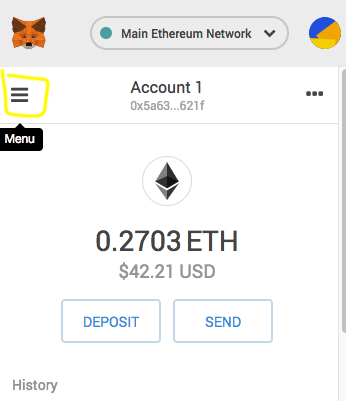
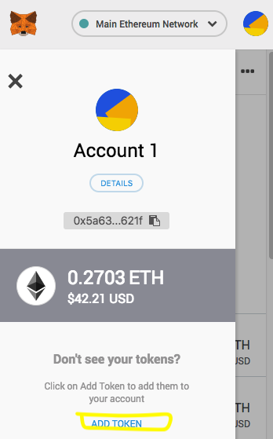
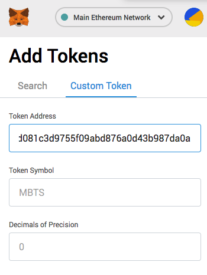
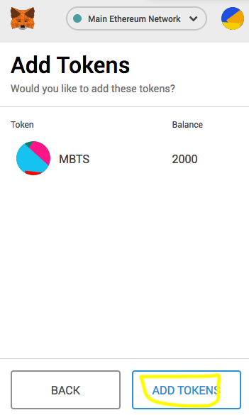
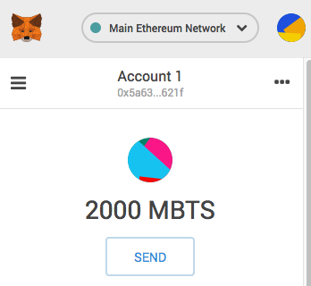

## Add Fuel Voucher Token to MetaMask

### Choose the account you are receiving your vouchers on
### Select Main Ethereum Network and open the Menu


### Select `Add Token`


### Select the Custom Token tab
### Enter the following Contract Address into the field: `Token Address`
``` 0xadd9617d081c3d9755f09abd876a0d43b987da0a ```
### Click `Next`


### Click `Add Tokens`


### You should now be able to interact with and see your voucher balance
